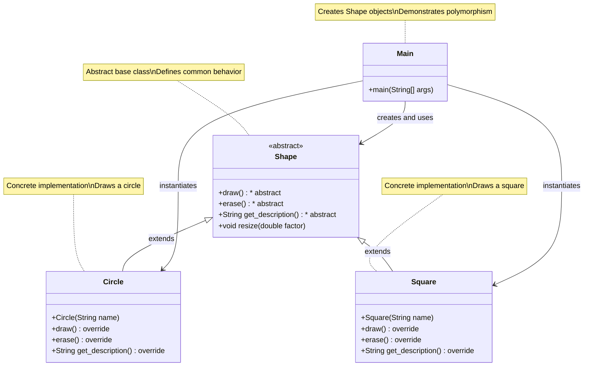

# Java Polymorphism Example

## Description

This project is a simple demonstration of polymorphism in Java using a hierarchy of geometric shape classes. The project illustrates fundamental object-oriented programming concepts such as inheritance, abstract classes, and polymorphism. Recent updates have introduced new abstract methods to enhance the functionality of the shape classes.

## Schema



## Project Structure

- `Shape.java`: Abstract base class that defines common behavior for all shapes, including new abstract methods for erasing and getting descriptions.

- `Circle.java`: Concrete implementation of a circular shape.

- `Square.java`: Concrete implementation of a square shape.

- `Main.java`: Main class that demonstrates the use of polymorphism.

## Features

- Use of an abstract class (Shape) with both abstract and concrete methods.

- Specific implementations for different types of shapes.

- New abstract methods for erasing shapes and getting descriptions.

- Demonstration of polymorphism by treating different objects through their common interface.

## How to Run

To run this project:

  - Make sure you have Java installed on your system.
  - Compile all Java files: `javac *.java`

### Run the main class:
```bash
java Main
```

### Expected Output
When running the program, you will see the following output: 
- ```Draw a circle```
- ```Draw a square```
- ```Erase a circle```
- ```Erase a square```
- ```Circle description```
- ```Square description```

## Demonstrated Concepts

`Abstraction`: The Shape class defines a common interface for all shapes.

`Inheritance`: The Circle and Square classes inherit from the base Shape class.

`Polymorphism`: The program treats different types of shapes through their common interface.

`Abstract Methods`: The draw(), erase(), and get_description() methods must be implemented by all subclasses.

## Extensibility

This project can be easily extended by adding new shapes that inherit from the Shape class, without needing to modify existing code (following the Open/Closed principle of SOLID).